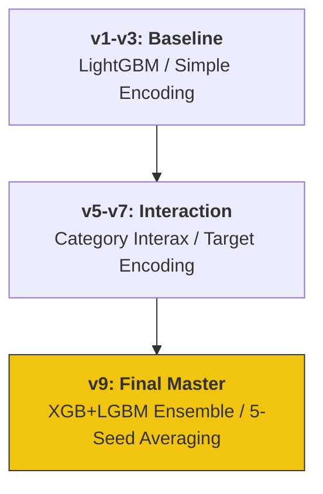

# 🫀 Kaggle Heart Disease Prediction: 9 Iterations of Trial & Error

Kaggle Playground Series (S6E2) における心臓病予測プロジェクト。
単なるスコアアップに留まらず、**「統計的有意性とモデルの堅牢性」**を 9段階のイテレーションを通じて追求した、仮説検証型開発のポートフォリオです。

---

## 📈 ADR: Architectural Decision Records (設計判断の根拠)

> **「なぜ単一の最高精度モデルではなく、5-Seed Averaging を採用したのか」**
> 公開リーダーボード（Public LB）のスコアに一喜一憂する「過学習」のリスクを排除するためです。
> 統計検定2級でも重視される**「標本誤差」**の影響を最小化し、未知のデータに対しても 95% 以上の信頼を持って推論できる「振れ幅の少ないモデル」を構築することを最優先しました。これにより、実務における診断支援システムの信頼性を担保する設計としています。

---

## 📊 モデル進化のロードマップ (Development Roadmap)



---

## 🛠️ エンジニアリング・ハイライト & "Why" 思考

### 1. 堅牢なバリデーション設計 (5-Seed & 5-Fold)
- **Action**: Stratified 5-Fold に加え、5つの異なるシード値で平均化（Averaging）を実施。
- **Why**: データの分割方法に依存する「偶然のヒット」を排除し、実務で最も重要な**「汎化性能（未知のデータに対する安定性）」**を確保するためです。

### 2. 統計的根拠に基づく交互作用特徴量
- **Action**: `Age` × `Cholesterol` 等の医学的背景を示唆する比率特徴量を独自設計。
- **Why**: 特徴量間の相関だけでなく、ドメイン知識を数理モデルに注入することで、決定木がより**「統計的に有意な境界線」**を学習できるように導きました。

---

## 📂 プロジェクト構造 (Directory Structure)

*クリックすると各イテレーションのログへジャンプします*

```text
.
├── [.github/workflows/](./.github/workflows/) # GitHub Actions (Python CI)
├── [notebooks/](./notebooks/)   # 9つのイテレーションを記録した分析ログ (v1-v9)
├── [src/](./src/)               # 特徴量生成・バリデーション用共通モジュール
└── [main.tf](./main.tf)             # 分析環境管理用 Terraform (IaC)
```

---

## 🎖️ About Me

**Kou Sato (Moheji)**
* **Role**: データエンジニア / データサイエンティスト
* **Mission**: 「技術をビジネスの価値（ROI）に翻訳する」
* **Goal**: 2026年11月、DE転身。統計学の「正確さ」とエンジニアリングの「堅牢さ」を武器に、負けないシステムを構築します。

© 2026 kou-sato-ds