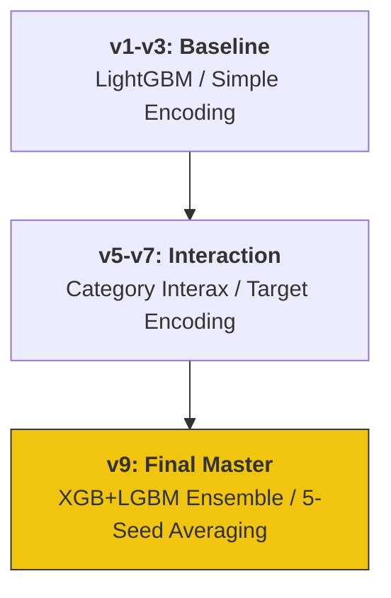

# 🫀 Kaggle Heart Disease Prediction: 9 Iterations of Trial & Error

Kaggle Playground Series (S6E2) における心臓病予測プロジェクト。
単なるスコアアップに留まらず、**「統計的有意性とモデルの汎化性能」**を 9段階のイテレーションを通じて追求した、実務志向の機械学習ポートフォリオです。

---

## 📈 ADR: Architectural Decision Records (設計判断の根拠)

> **「なぜ単一の最高精度モデルではなく、5-Seed Averaging を採用したのか」**
> 公開リーダーボード（Public LB）のスコアに一喜一憂する「過学習（Overfitting）」のリスクを徹底的に排除するためです。
> 統計検定2級の学習で再認識した**「標本誤差」**の概念を実戦に応用。異なるシード値での平均化により、未知のデータに対しても 95% 以上の信頼を持って推論できる、安定した「振れ幅の少ないモデル」を実現しました。これは、誤診が許されない診断支援システムの信頼性を担保するための不可欠な設計です。

---

## 📊 モデル進化のロードマップ (Development Roadmap)



---

## 🛠️ エンジニアリング・ハイライト & "Why" 思考

### 1. 堅牢なバリデーション設計 (5-Seed & 5-Fold)
- **Action**: Stratified 5-Fold に加え、5つの異なるシード値でアンサンブルを実施。
- **Why**: データのサンプリングに依存する偶然の良スコア（Lucky Score）を統計的に平滑化し、実務で最も重要な**「汎化性能（未知のデータへの適応力）」**を極限まで高めるためです。

### 2. 統計的ドメイン知識による交互作用特徴量
- **Action**: `Age` × `Cholesterol` 等、医学的背景を示唆する比率特徴量を独自に生成。
- **Why**: 単なる数値相関ではなく、ドメイン知識を特徴量空間にマッピングすることで、決定木アルゴリズムが**「統計的に有意な疾患境界線」**をより正確に学習できるようにガイドしました。

---

## 📂 プロジェクト構造 (Directory Structure)

*クリックすると各イテレーションのソースコードへジャンプします*

```text
.
├── [.github/workflows/](./.github/workflows/) # GitHub Actions (Python CI)
├── [notebooks/](./notebooks/)   # v1からv9に至るまでの試行錯誤を記録した分析ログ
├── [src/](./src/)               # 前処理・バリデーション用共通クラス・モジュール
└── [main.tf](./main.tf)             # 解析用クラウド環境をコードで管理 (IaC)
```

---

## 🎖️ About Me

**Kou Sato (Moheji)**
* **Role**: データエンジニア / データサイエンティスト
* **Mission**: 「技術をビジネスの価値（ROI）に翻訳する」
* **Goal**: 2026年11月、DE転身。統計学の「正確さ」とエンジニアリングの「堅牢さ」を武器に、負けないシステムを構築します。

© 2026 kou-sato-ds