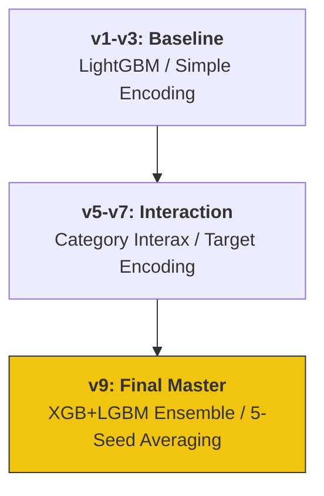

# 🫀 Kaggle Heart Disease Prediction: 9 Iterations of Trial & Error

Kaggle Playground Series (S6E2) における心臓病予測プロジェクト。
単一のモデル構築に留まらず、**9段階にわたる特徴量エンジニアリングとアンサンブル手法の深化**を記録した、仮説検証型開発のポートフォリオです。

---

## 📈 モデル進化のロードマップ (Development Roadmap)



---

## 🛠️ エンジニアリング・ハイライト & "Why" 思考

### 1. 堅牢なバリデーション設計 (5-Seed & 5-Fold)
- **Action**: Stratified 5-Fold に加え、5つの異なるシード値で平均化（Averaging）を実施。
- **Why**: リーダーボード（Public LB）への過学習を防ぎ、実務で最も重要な**「未知のデータに対する予測の安定性（堅牢性）」**を確保するためです。

### 2. ドメイン知識に基づく交互作用特徴量
- **Action**: `Age` × `Cholesterol` や `BloodPressure` 関連の比率など、医学的背景を示唆する交互作用特徴量を独自設計。
- **Why**: 単なる数値の羅列ではなく、データが持つ「背景」をモデルに明示することで、決定木がより有意な境界線を学習できるように整形しました。

---

## 📊 実績と分析 (Results & Analysis)

- **ベストスコア**: 0.95337 (AUC)
- **主要手法**: 5-Seed Averaging, 特徴量重要度に基づく反復的改善
- **インフラ**: TerraformによるAWS上でのデータパイプライン管理

---

## 📂 プロジェクト構造 (Directory Structure)

```text
.
├── .github/workflows/ # GitHub Actions (Python CI)
├── notebooks/         # 9つのイテレーションを記録した分析ログ
├── src/               # 特徴量生成・バリデーション用共通モジュール
└── main.tf            # 分析環境管理用 Terraform (IaC)
```

---

## 🎖️ About Me

**Kou Sato (Moheji)**
データエンジニア / データサイエンティスト
「技術をビジネスの価値に変換する」をモットーに、IaCからMLモデル構築まで一貫したデリバリーを追求しています。